# From Audit to Accountability

**An algorithmic impact assessment and regulatory review of cost-as-a-proxy healthcare algorithms**

[**Live dashboard →**](https://aditya-ravi11.github.io/EAIDS/) · [**IEEE report (PDF)**](report/MiniProject_EAIDS_Group2.pdf) · [**3-page explanation (PDF)**](docs/MiniProject_EAIDS_Group2_Explanation.pdf) · EAIDS mini-project, Group 2, Batch B2

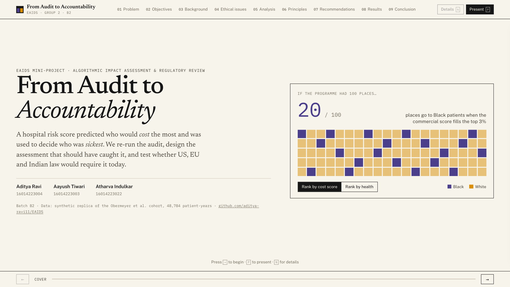

| Name | Roll No. | Batch |
|---|---|---|
| Aditya Ravi | 16014223004 | B2 |
| Aayush Tiwari | 16014223003 | B2 |
| Atharva Indulkar | 16014223022 | B2 |

---

## The problem

Hospitals use commercial risk scores, such as Optum's Impact Pro, to decide who gets into high-risk care-management programmes. Tools of this class are applied to roughly 200 million people in the US each year.

The score predicts **future healthcare cost** and treats it as a proxy for **health need**. Black patients receive less care at the same level of illness, so an accurate cost model ranks them as healthier than they are, and they are under-referred. Obermeyer et al. showed this in [*Science*, 2019](https://doi.org/10.1126/science.aax2342).

Finding the bias is no longer the open question. This project asks the governance questions instead: what should the deploying hospital have done, who is accountable, what assessment should have been required before deployment, and would the law in the **US**, the **EU** or **India** require it today?

## The dashboard: built for a live demo

The dashboard is a **deck**. Each of the nine required sections is one full screen, and long sections step through views (26 in total). Type and charts scale with the window, so every view fits a laptop or a 1080p projector without scrolling.

| Key | Action |
|---|---|
| <kbd>→</kbd> / <kbd>←</kbd> (or Space, PageDown/PageUp) | Next / previous view |
| <kbd>1</kbd>–<kbd>9</kbd>, <kbd>0</kbd> | Jump to §01–§09, or to the cover |
| <kbd>P</kbd> | Present mode (full-screen, minimal chrome) |
| <kbd>N</kbd> | Details drawer with method notes for the current view |
| <kbd>Esc</kbd> | Close the drawer / leave full-screen |

Every view has its own link, for example [`#/analysis/explorer`](https://aditya-ravi11.github.io/EAIDS/#/analysis/explorer) or [`#/results/law`](https://aditya-ravi11.github.io/EAIDS/#/results/law). The closing screen has a QR code that opens the dashboard on the audience's phones. A step-by-step demo script is in the [explanation PDF](docs/MiniProject_EAIDS_Group2_Explanation.pdf) (section 6).

| Required section | Dashboard | Report |
|---|---|---|
| Problem definition | §01: pipeline with the flawed label, key numbers | §I |
| Objectives | §02: six objectives with jump links | §II |
| Background / context | §03: 2019–2027 swimlane timeline (US, EU, India) | §III |
| Ethical issue identification | §04: eight issues by stage and severity | §IV |
| Methodology & analysis | §05: data; calibration; mechanism; biomarkers; threshold explorer; counterfactual; human review | §V |
| Relevant ethical principles | §06: crosswalk of seven frameworks | §VI |
| Proposed solution / recommendations | §07: seven-gate AIA, accountability matrix, actions by actor | §VII |
| Results / findings | §08: replication; label choice; label mixer; AIA scorecard; regulatory matrix; verdicts; key findings | §VIII |
| Conclusion | §09: answers, limitations and sources, thank-you with QR code | §IX |

## Key findings

1. **The bias replicates.** At the same risk score, Black patients have **0.61 more active chronic conditions** (95% CI 0.56–0.67). The score's calibration on *cost* does not differ by race.
2. **The corrected counterfactual is starker than the published one.** Run as the original code ran, our swap reproduces the authors' published synthetic output exactly (18.4% → 44.8%). With their 2022 bug fix it gives **59.2%**.
3. **The label, not the model, drives it.** With the same features and the same LASSO model, the Black share of the top 3% is **19.0%** with a cost label, **25.8%** with avoidable cost and **28.2%** with chronic conditions.
4. **Mitigation is cheap.** A 60/40 cost/health blend captures the same share of spending as the cost-only model, raises the Black share to 25.5% and closes 46% of the excess-illness gap.
5. **Human review did not fix it.** Enrolled Black patients were still 1.24 chronic conditions sicker than enrolled White patients.
6. **No jurisdiction clearly requires the missing test for this deployment as of October 2026.**
   - **EU:** comes closest, through the GDPR DPIA and the Race Equality Directive. AI Act duties were delayed to December 2027 and probably reach only public bodies.
   - **US:** federal duties are keyed to a tool's *inputs*, not its *label*, and the disparate-impact route narrowed in July 2026.
   - **India:** relies on soft law until DPDP duties begin in May 2027.

## Screenshots

| | |
|---|---|
| **§01 Problem**<br>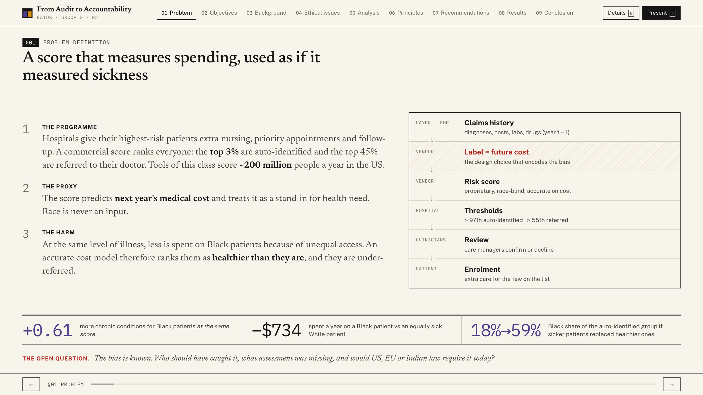 | **§03 Background: swimlane timeline**<br>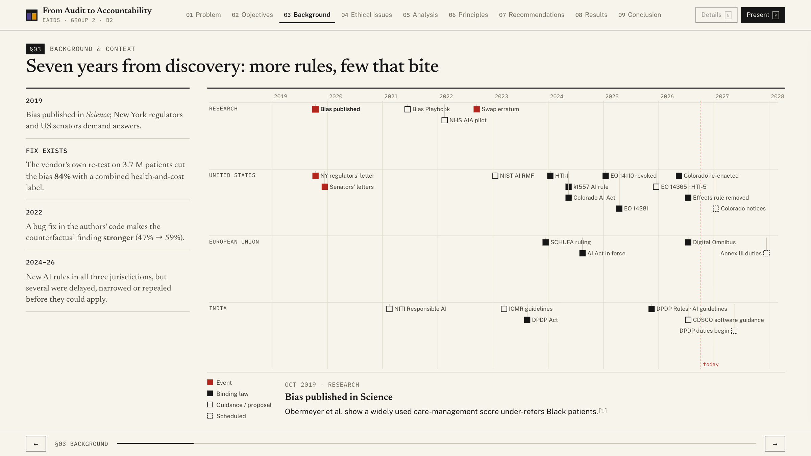 |
| **§04 Ethical issues**<br>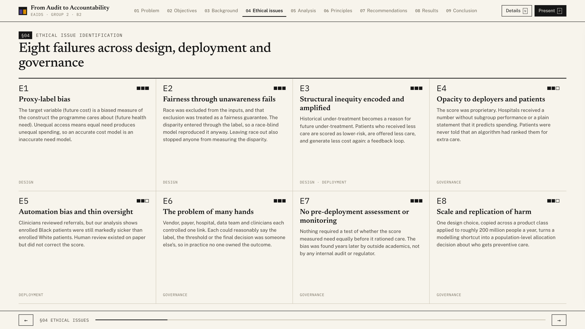 | **§05 Calibration (health ↔ cost toggle)**<br>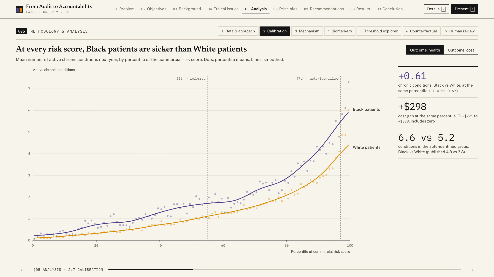 |
| **§05 Threshold explorer**<br>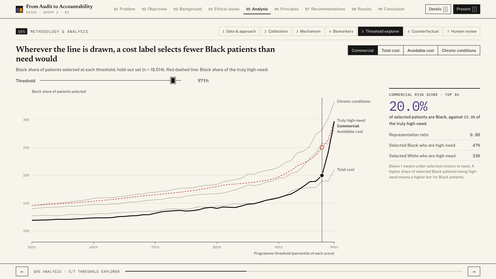 | **§05 Counterfactual swap**<br>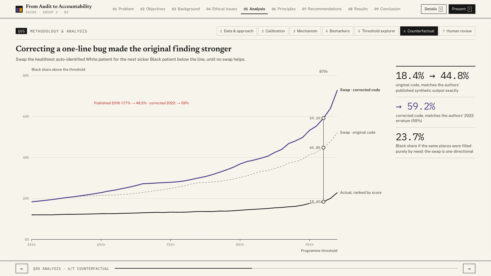 |
| **§06 Ethical principles**<br>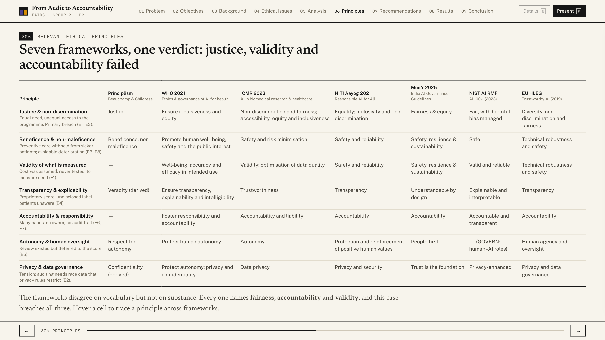 | **§07 Seven-gate impact assessment**<br>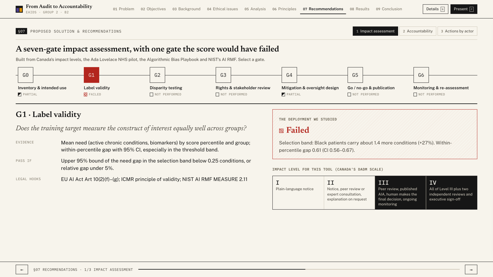 |
| **§07 Accountability matrix**<br>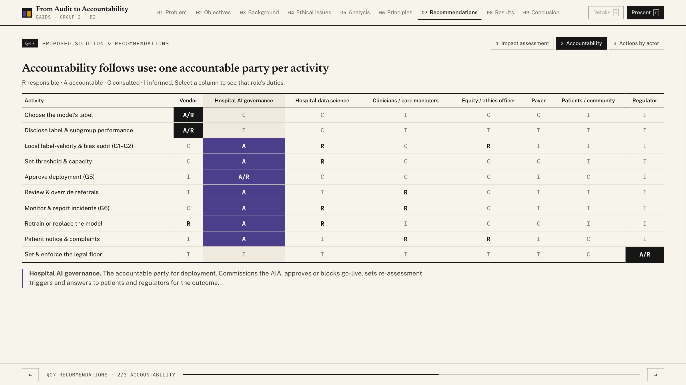 | **§08 Label choice**<br>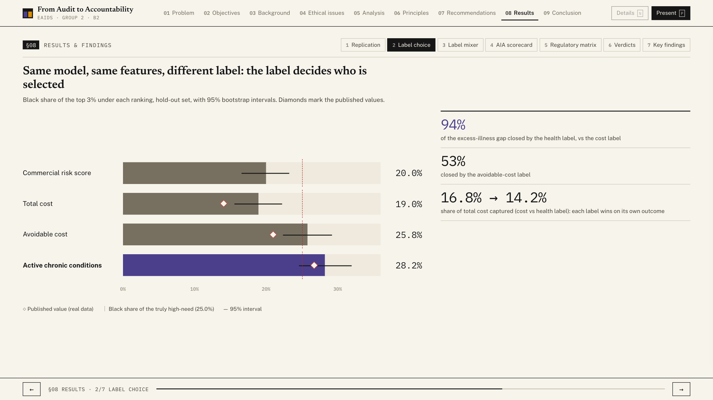 |
| **§08 Label mixer**<br>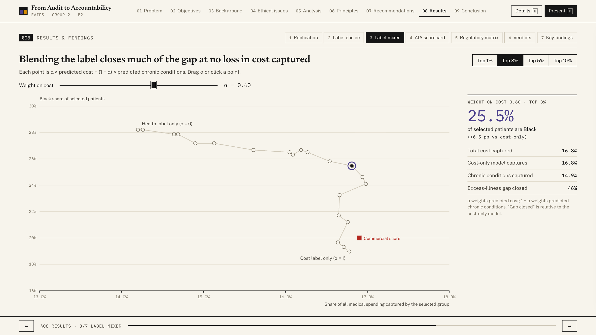 | **§08 Regulatory matrix**<br>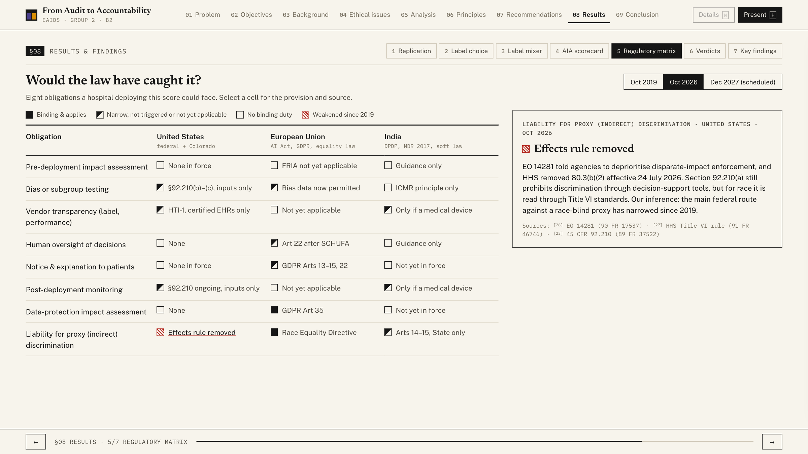 |
| **§09 Conclusion**<br>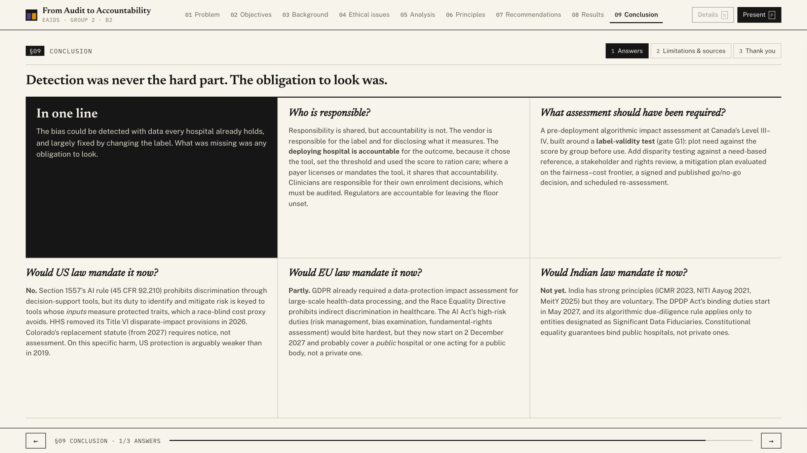 | **Present mode**<br>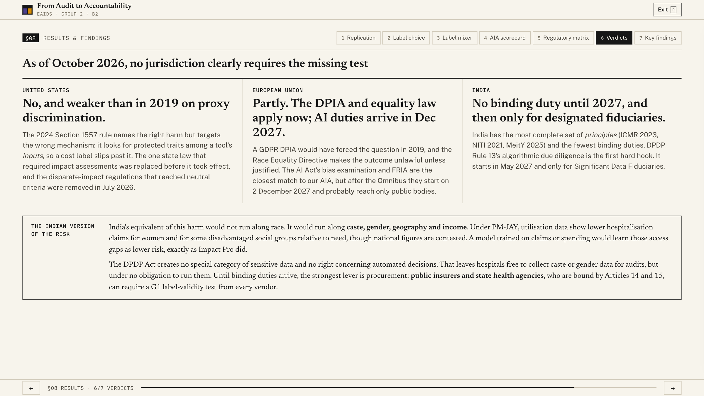 |
| **Details drawer (N)**<br>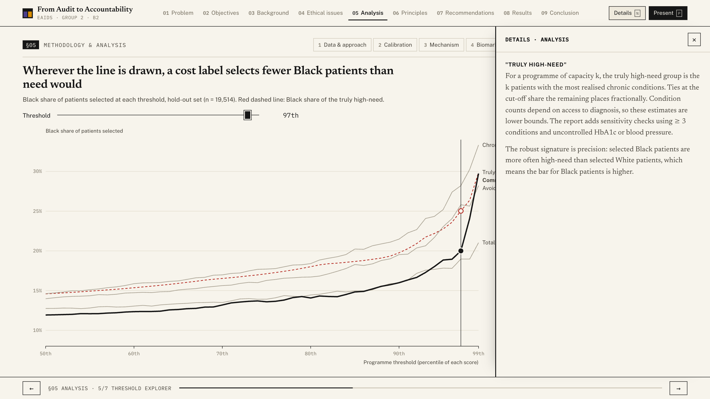 | **Phone**<br>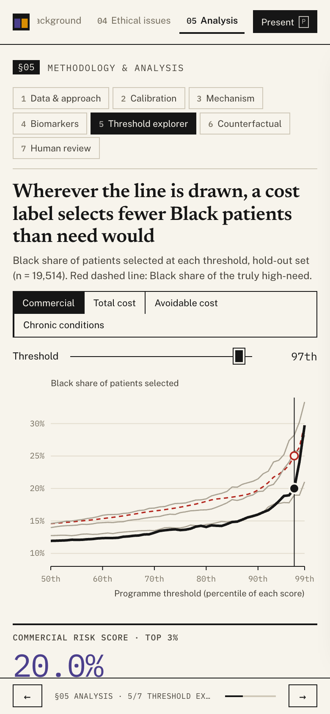 |

## Repository layout

```
analysis/        Python pipeline: data fetch, audit, label experiments, figures, LaTeX tables
content/         Curated, cited content: regulatory matrix, AIA gates, RACI, principles, timeline, references
web/             Dashboard deck (Vite + TypeScript + d3) and the printable explanation page
report/          IEEE paper (IEEEtran): main.tex, refs.bib, generated figures/tables, MiniProject_EAIDS_Group2.pdf
docs/            Screenshots and MiniProject_EAIDS_Group2_Explanation.pdf
.github/         GitHub Pages deployment workflow
```

There is one source of truth. `analysis/run_all.py` writes JSON into `web/src/data/` and generates `report/tables/*.tex`, including `numbers.tex`, the macros used in the paper's prose. It also writes `report/refs.bib` from `content/references.json`. The dashboard, the explanation and the paper therefore cannot drift apart.

## Reproduce

Requirements: Python ≥ 3.11, Node ≥ 20, Google Chrome (for screenshots and the explanation PDF), and TeX Live with `IEEEtran` (for the report).

1. Install the Python dependencies and run the pipeline:

   ```bash
   pip install -r analysis/requirements.txt
   ```

   ```bash
   python analysis/run_all.py
   ```

2. Start the dashboard locally, then open `http://localhost:5173/EAIDS/`:

   ```bash
   cd web && npm ci && npm run dev
   ```

3. Build the report:

   ```bash
   ./report/build.sh
   ```

4. Refresh the screenshots and the explanation PDF:

   ```bash
   cd web && npm run build && npm run screenshots && npm run explanation
   ```

`run_all.py` downloads the synthetic cohort (17.8 MB) into `data/raw/` on first run. The label models take a few minutes to fit and are cached in `data/cache/`. The pipeline asserts two replication checks: the original swap logic must reproduce the authors' published 0.1841 → 0.4477, and no year-*t* variable may leak into the features. Screenshots and the PDF use your installed Chrome through `playwright-core`, so no browser download is needed.

## Data

The analysis uses the **synthetic** cohort released by Obermeyer, Powers, Vogeli and Mullainathan at [gitlab.com/labsysmed/dissecting-bias](https://gitlab.com/labsysmed/dissecting-bias). It has 48,784 patient-years, generated with *synthpop* to mirror the original data, which cannot be shared.

That repository carries no licence, so this repository **does not redistribute the raw file**. It is fetched by script, and only aggregate statistics are committed. Synthetic results match the structure of the published findings, not their exact magnitudes; the report and dashboard show both side by side.

## Notes

- Race is analysed as a social category whose effects here run through access to care, not biology. "White" in the source data means all non-Black patients.
- The regulatory coding reflects our reading of primary sources **as of 7 October 2026** and is not legal advice. Several instruments were still changing, including ONC's HTI-5 proposal, the Colorado litigation and the EU's GDPR omnibus.

## Licence

Code: MIT (see [LICENSE](LICENSE)). The synthetic patient data belong to their authors and are not included.
