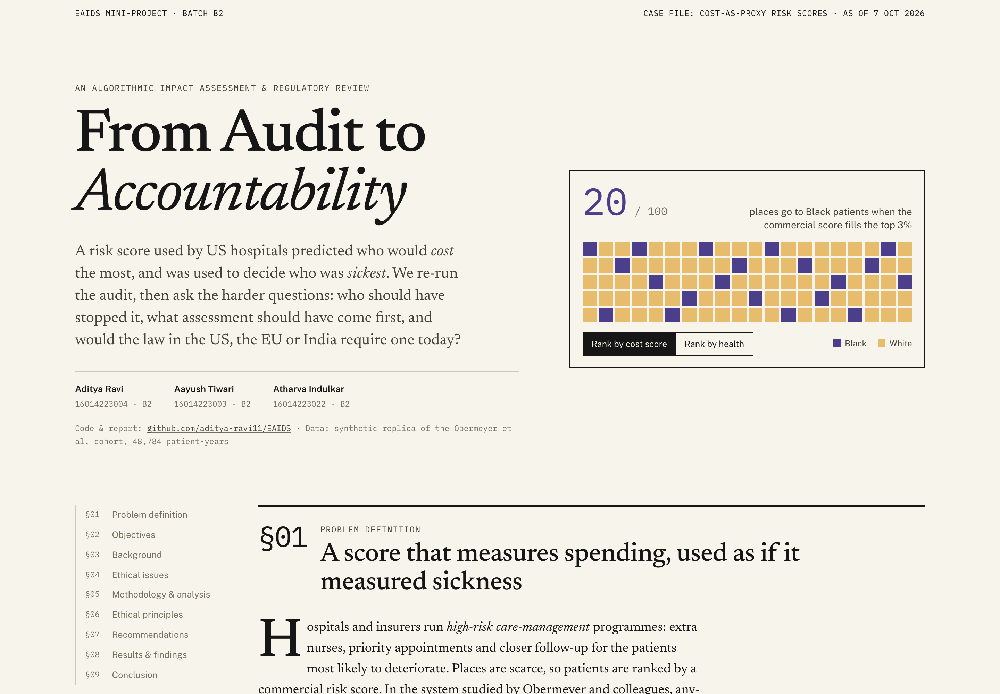
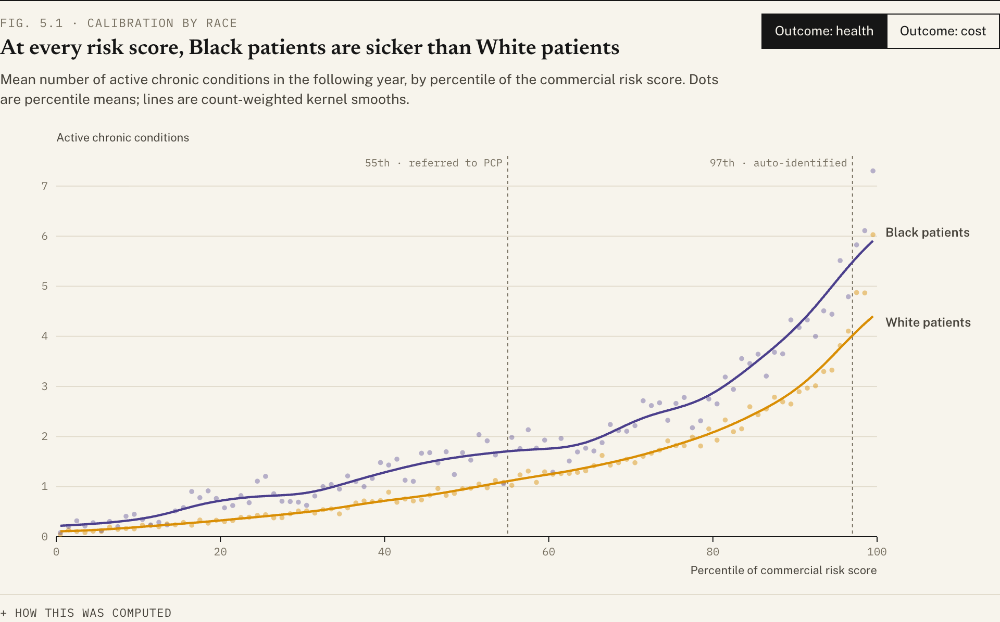
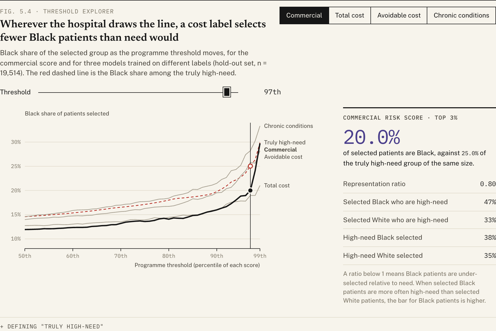
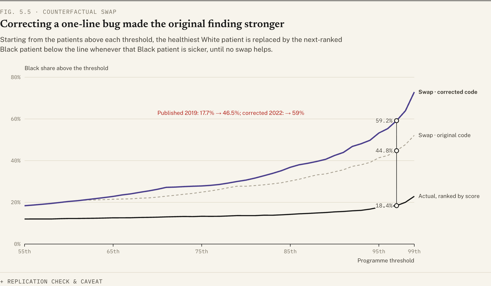
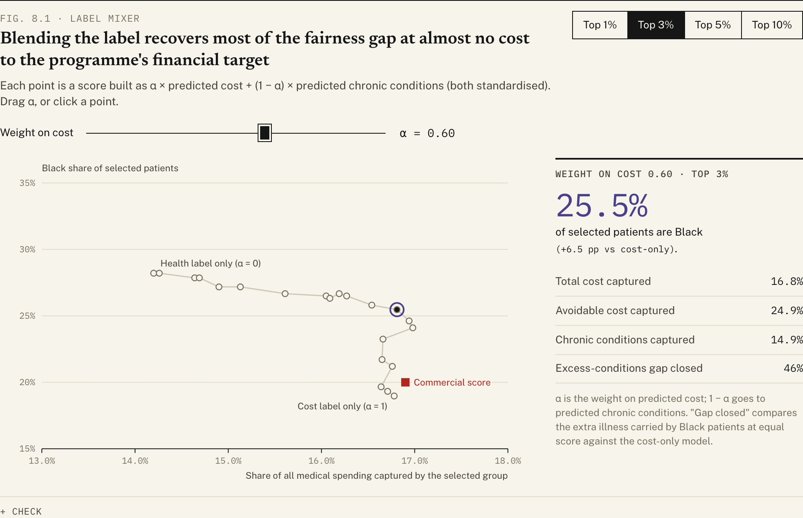
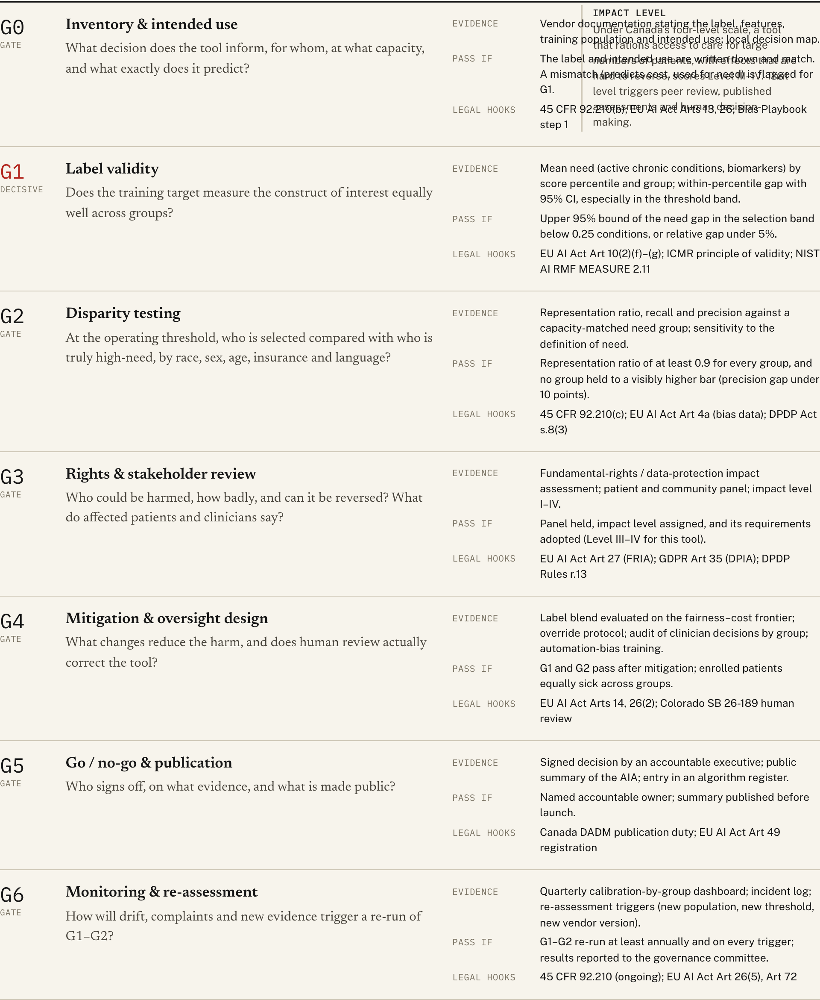
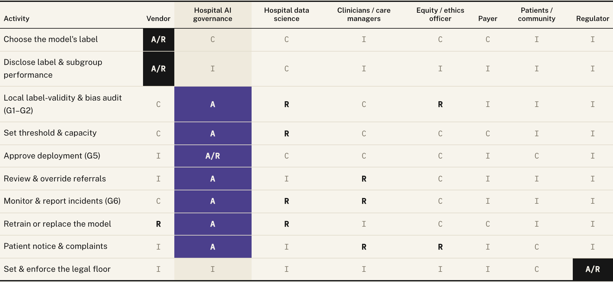
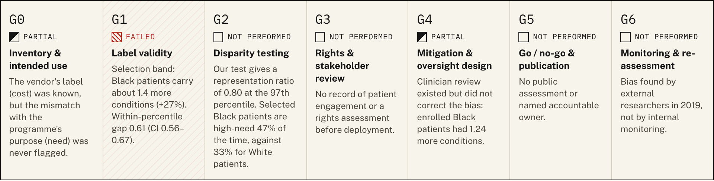
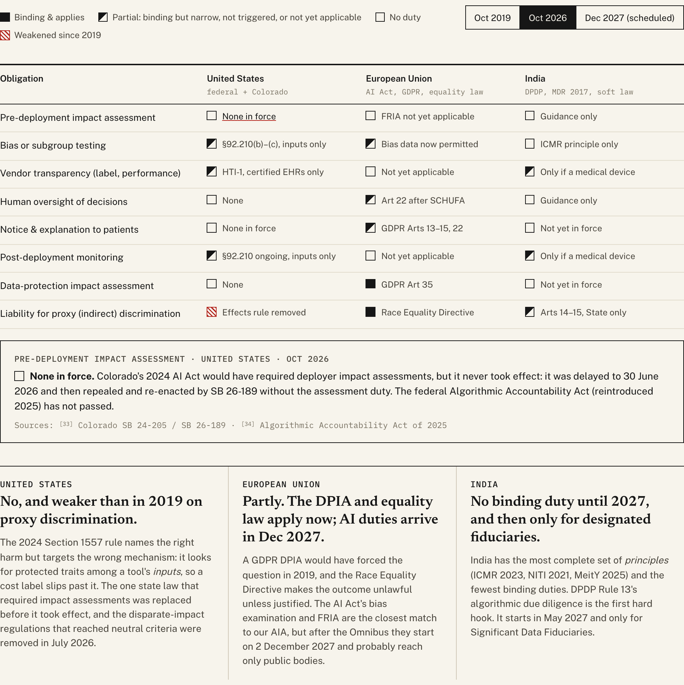
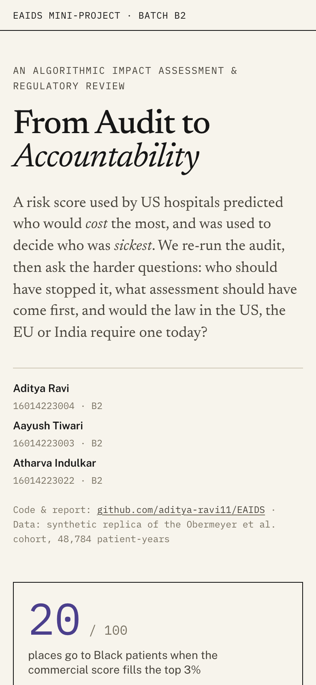

# From Audit to Accountability

**An algorithmic impact assessment and regulatory review of cost-as-a-proxy healthcare algorithms**

[**Live dashboard →**](https://aditya-ravi11.github.io/EAIDS/) · [**IEEE report (PDF)**](report/EAIDS_Report.pdf) · EAIDS mini-project, Batch B2



| Name | Roll No. | Batch |
|---|---|---|
| Aditya Ravi | 16014223004 | B2 |
| Aayush Tiwari | 16014223003 | B2 |
| Atharva Indulkar | 16014223022 | B2 |

---

## The problem

Hospitals use commercial risk scores, such as Optum's Impact Pro, to decide who gets into high-risk care-management programmes. Tools of this kind are applied to roughly 200 million people in the US each year. The score predicts **future healthcare cost** and treats it as a proxy for **health need**. Black patients receive less care at the same level of illness, so an accurate cost model ranks them as healthier than they are, and they are under-referred. Obermeyer et al. ([*Science*, 2019](https://doi.org/10.1126/science.aax2342)) showed this.

Finding the bias is no longer the open question. This project asks the governance questions instead:

- What should the deploying hospital have done before using the score?
- Who is accountable for the harm?
- What assessment should have been required before deployment?
- Would the law in the **US**, the **EU** or **India** require that assessment today?

## What's in this repository

| Required section | Where it lives |
|---|---|
| Problem definition, objectives, background | Dashboard §01–§03, report §I–III |
| Ethical issue identification | Dashboard §04 (charge sheet E1–E8), report §IV |
| Methodology & analysis | `analysis/` pipeline, dashboard §05, report §V |
| Relevant ethical principles | Dashboard §06 (framework crosswalk), report §VI |
| Proposed solution / recommendations | Seven-gate AIA, accountability matrix and actions by actor: dashboard §07, report §VII |
| Results / findings | Label mixer, retrospective scorecard and regulatory matrix: dashboard §08, report §VIII |
| Conclusion | Dashboard §09, report §IX |

## Key findings

1. **The bias replicates.** At the same risk score, Black patients have **0.61 more active chronic conditions** (95% CI 0.56–0.67). The score's calibration on *cost* does not differ by race.
2. **The corrected counterfactual is starker than the published one.** We re-implemented the authors' "swap" exercise. Run as the original code ran, it reproduces their published synthetic output exactly (18.4% → 44.8%). With their 2022 bug fix it gives **59.2%**.
3. **The label, not the model, drives it.** With the same features and the same LASSO model, the Black share of the top 3% is **19.0%** when trained on total cost, **25.8%** on avoidable cost and **28.2%** on chronic conditions.
4. **Mitigation is cheap.** A blended label (60% cost, 40% health) captures the same share of spending as the cost-only model. It raises the Black share to 25.5% and closes 46% of the excess-illness gap.
5. **Human review did not fix it.** Enrolled Black patients were still 1.24 chronic conditions sicker than enrolled White patients.
6. **No jurisdiction clearly requires the missing test for this deployment as of October 2026.**
   - **EU:** comes closest, through the GDPR DPIA requirement and the Race Equality Directive. The AI Act's duties were delayed to Dec 2027 and probably reach only public bodies.
   - **US:** federal duties are keyed to a tool's *inputs*, not its *label*, and the disparate-impact route narrowed in 2026.
   - **India:** relies on soft law until DPDP duties begin in May 2027.

## Screenshots

**Calibration audit.** Toggle between health and cost.


**Threshold explorer.** Move the programme cut-off and compare who is selected with who is truly high-need.


**Counterfactual swap.** Original code, corrected code and actual.


**Label mixer.** Blend cost and health labels and watch the trade-off.


**Seven-gate algorithmic impact assessment.**


**Accountability (RACI) matrix.**


**Retrospective scorecard.**


**Regulatory matrix.** US / EU / India for 2019, 2026 and the end of 2027, with the provision and source behind every cell.


**Mobile.**



## Repository layout

```
analysis/        Python pipeline: data fetch, audit, label experiments, figures, LaTeX tables
content/         Curated, cited content: regulatory matrix, AIA gates, RACI, principles, timeline, references
web/             Dashboard (Vite + TypeScript + d3), reads analysis output and content/ at build time
report/          IEEE paper (IEEEtran): main.tex, refs.bib, generated figures/tables, EAIDS_Report.pdf
docs/screenshots Dashboard screenshots used here and in the report
.github/         GitHub Pages deployment workflow
```

A single source of truth feeds everything. `analysis/run_all.py` writes JSON into `web/src/data/` and generates `report/tables/*.tex` (including `numbers.tex`, the macros used in the paper's prose) and `report/refs.bib` from `content/references.json`. The website and the paper therefore cannot drift apart.

## Reproduce

Requirements: Python ≥ 3.11, Node ≥ 20, and a TeX Live installation with `IEEEtran` (for the report only).

```bash
pip install -r analysis/requirements.txt
python analysis/run_all.py
```

```bash
cd web && npm ci && npm run dev
```

Then open `http://localhost:5173/EAIDS/`.

```bash
./report/build.sh
```

`run_all.py` downloads the synthetic cohort (17.8 MB) into `data/raw/` on first run. The label-choice models take a few minutes to fit and are cached in `data/cache/`. The pipeline asserts the replication checks: the original swap logic must reproduce the authors' published 0.1841 → 0.4477, and no year-*t* variable may leak into the features.

To refresh the screenshots after changing the site:

```bash
cd web && npm run build && npm run screenshots
```

This uses your installed Google Chrome through `playwright-core`; no browser download is needed.

## Data

The analysis uses the **synthetic** cohort released by Obermeyer, Powers, Vogeli and Mullainathan at [gitlab.com/labsysmed/dissecting-bias](https://gitlab.com/labsysmed/dissecting-bias). It has 48,784 patient-years, generated with *synthpop* to mirror the original data, which cannot be shared. That repository carries no licence, so this repository **does not redistribute the raw file**; it is fetched by script, and only aggregate statistics are committed. Synthetic results match the structure of the published findings, not their exact magnitudes. The report and dashboard show both side by side.

## Notes

- Race is analysed as a social category whose effects here run through access to care, not biology. "White" in the source data means all non-Black patients.
- The regulatory coding reflects our reading of primary sources **as of 7 October 2026** and is not legal advice. Several instruments, including ONC's HTI-5 proposal, the Colorado litigation and the EU's GDPR omnibus, were still changing.

## Licence

Code: MIT (see [LICENSE](LICENSE)). The synthetic patient data belong to their authors and are not included.
